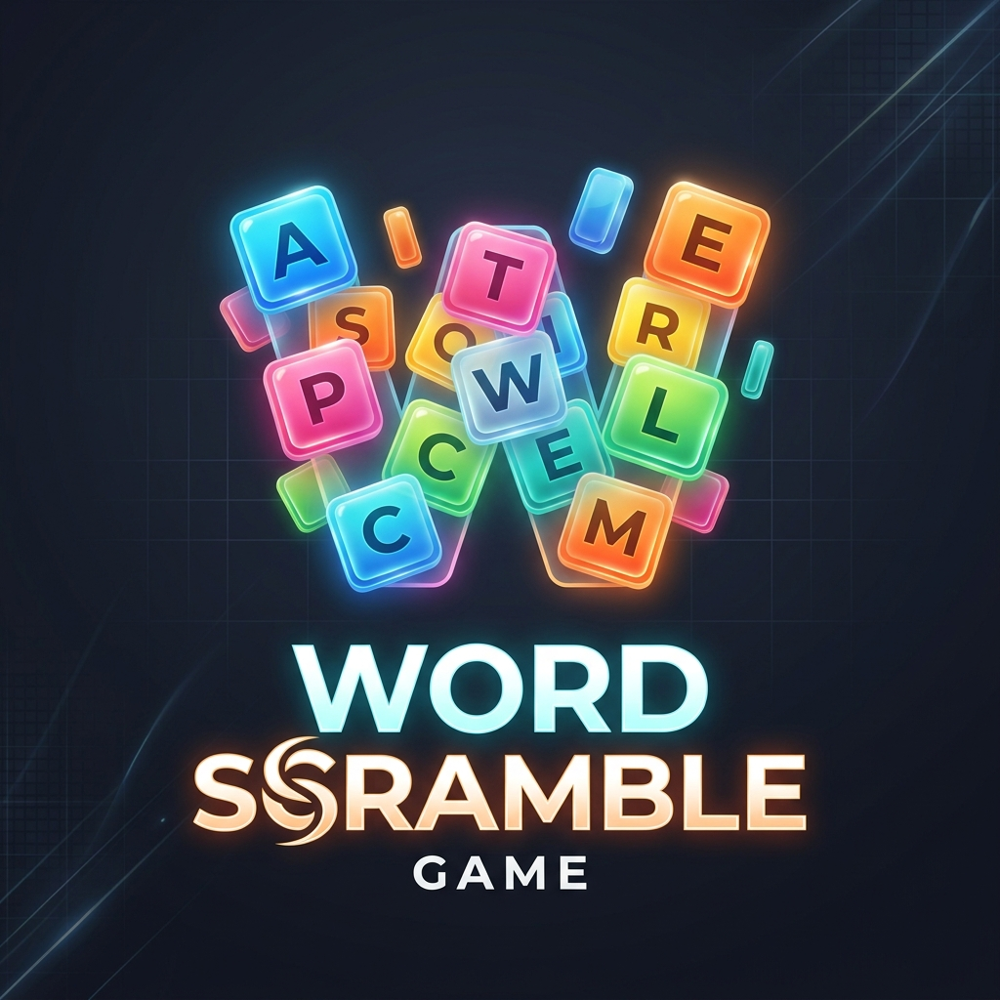

<p align="center">
  
</p>

# 🎮 Word Scramble Game

<p align="center">
  <a href="https://word-scramble-game.up.railway.app/">
    
  </a>
</p>

---

### ✨ [Click Here to Play the Live Game!](https://word-scramble-game.up.railway.app/) ✨

---

A premium, full-stack word puzzle experience. Test your speed, expand your vocabulary, and climb the global leaderboard!

## 🚀 Key Features
- **🕒 Three Game Modes:** Choose between Classic, Survival, and High-Speed challenges.
- **⚡ Power-up System:** Use **Freeze** to stop time or **Magnet** to reveal hints.
- **🏆 Global Leaderboard:** Real-time persistence of your highest scores using MySQL.
- **💎 Premium UI:** Glassmorphism design with smooth animations and responsive layouts.
- **🥚 Easter Eggs:** Try to find the secret "Cheat Mode" hidden in the interface!

## 🛠️ Technology Stack
- **Backend:** Java 21, Spring Boot 3.2, Spring Data JPA
- **Frontend:** React 18, Vite, Vanilla CSS
- **Database:** MySQL 8.0
- **Hosting:** [Railway.app](https://railway.app/)

## 📦 Local Setup

### Prerequisites
- JDK 21+
- Node.js 18+
- MySQL Server

### 1. Clone the repository
```bash
git clone https://github.com/Strixxy/Word-Scramble-Game.git
cd Word-Scramble-Game
```

### 2. Backend Configuration
Update `src/main/resources/application.properties` with your local database credentials.
```bash
mvn spring-boot:run
```

### 3. Frontend Setup
```bash
cd frontend
npm install
npm run dev
```

## 🌐 Deployment
This project is optimized for **Railway.app**. Simply connect your GitHub repository and link a MySQL service. The application will automatically detect environment variables for the database connection.

---
<p align="center">Built with ❤️ by Antigravity</p>
